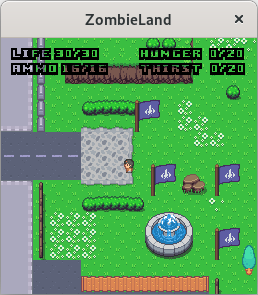
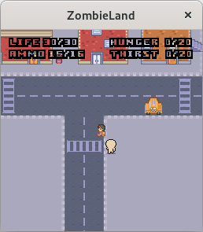
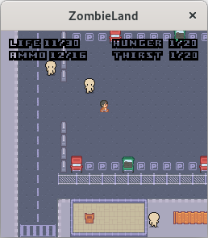
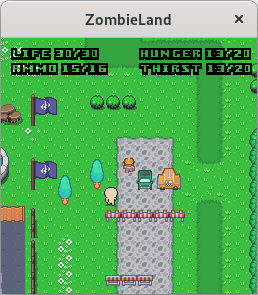
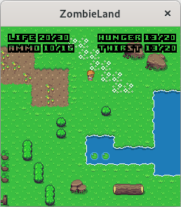
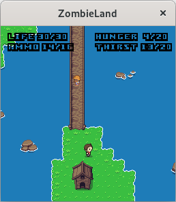

__What is Zombieland?__

Zombieland is a working title for a game, a little MMO about the struggle for
survival of humans against zombies.

__Where can I find the latest version of Zombieland?__

There are commits tagged as released versions, but I'd suggest building from the
latest commit, since new features and bugfixes happen frequently.

__On which platforms does Zombieland run?__

Zombieland is written in portable C and uses SDL2, SDL2_image, SDL2_ttf and
SDL2_mixer for multimedia, so that part is fairly portable; networking code uses
the Posix API.  Of course it will work on GNU/Linux and the BSDs, also on Mac Os
X; on Windows you will probably need some compatibility layer, let me know if
you succeed!  For other platforms, consult your docs.

The configure and build toolchain is autotools, but building is easy enough that
you can do it yourself.

I'm also working on an easy-to-install package for Windows and some GNU/Linux
distributions.

__How can I build Zombieland?__

If you have the dependencies installed (including the autotools), just do the
usual from the directory of the repository:

 $ autoreconf -fi && ./configure && make

__I don't have the autotools...__

You are truly the lazy type!  Then these commands will probably suffice:

 $ cc -o zombieland client.c zombieland.c -lSDL2 -lSDL2_image -lSDL2_ttf -lSDL2_mixer
 $ cc -o zombielandd server.c zombieland.c malloc.c -lSDL2

__How do I install Zombieland?__

I don't think installation works yet.  Just build and run the game from the root
of the cloned repository.

__How can I play Zombieland?__

Start the server (zombielandd) on some computer, then start the client
(zombieland) with two arguments: the address of the server and any username you
like.  Optionally, pass a third argument with a number between 0 and 6 to choose
your appearance; see the file character.png to preview each look, numbered from
0 to 6 going down.

Move around with the arrows or with WASD, fire with F, stab with R to hit
enemies nearby with the knife, interact with objects (reading signs and so on)
with Space and close the game with Esc.  Any number of players can shoot at each
other and at the zombies until they die.
You can also open and close the inventory with Q; you can collect rotten meat
dropped by zombies in your bag.  If you find a searchable object in the
environment, a symbol with a bag will appear on that object; pressing Q will
then open both your inventory and that bag; with Space you can select an object
and move it between the two inventories.
There's a day-night cycle in the game.

You can configure the controls before playing by passing the -k option.

The client limits display frame rate to 30 fps by default; you can get unlimited
fps with the -u option.

__Can I test Zombieland locally?__

Yes.  After building, start first the server (zombielandd), then the client
(zombieland) on another terminal, the latter with 127.0.0.1 and any username as
arguments (optionally a third argument to choose your appearance, see "How can I
play Zombieland?").  You can even run multiple clients on the same system.

__What is Zombieland capable to do?__

I tested Zombieland on a LAN and I confirmed that multiple players can move in
the same 2D map and fight.

__Does Zombieland work across architectures?__

It should.  Let me know if you find any issue.

__Who made the assets?__

See ASSET-CREDITS.

__Why can't I shut down the server with Ctrl-C?__

I'm not sure, but probably reading sockets non-blockingly changes the default
handling of SIGINT.  I will look into it further.

__Does Zombieland contain any line of code written by AI?__

No!  This is a game about zombies, not written by zombies.

__How can I reach the author?__

You can write an email at monacoandrea + 94 + at + gmail + .com, where "+" is
concatenation.

__Can I donate something to the author?__

Yes, I have Patreon (https://www.patreon.com/c/andreamonaco) and Liberapay
(https://liberapay.com/andreamonaco).  Thanks for your support.
